<div align="center">

# Smart Task Tracker

**A modern, full-featured task management app built with Flutter & Firebase**

[](https://flutter.dev)
[](https://firebase.google.com)
[](https://riverpod.dev)
[](https://apple.com)

</div>

---

## 📱 Demo

<div align="center">

| Onboarding | Features & Dark Mode |
|:---:|:---:|
| 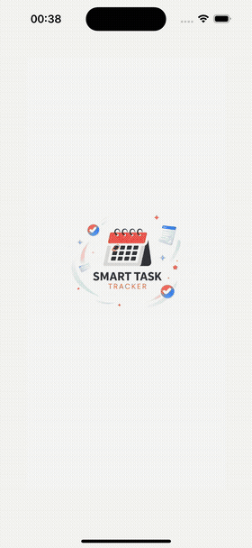 | 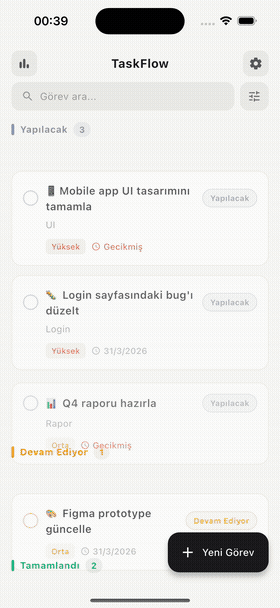 |

</div>

---

## 🖼 Screenshots

<div align="center">

| Onboarding | Login | Task List |
|:---:|:---:|:---:|
| 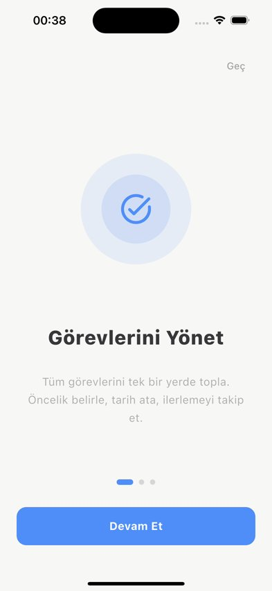 | 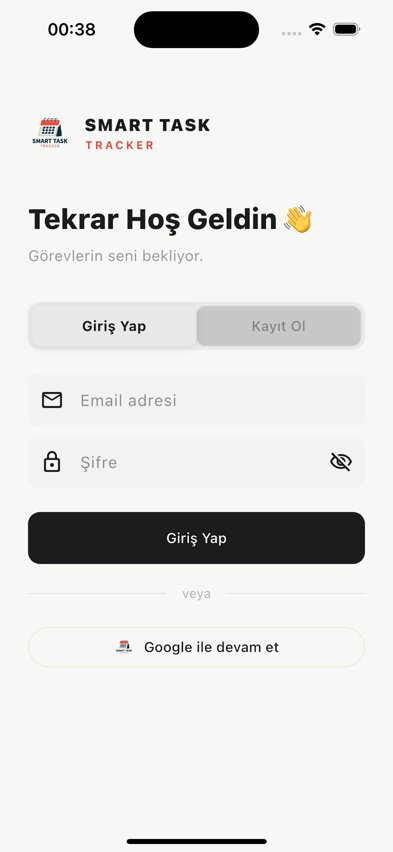 | 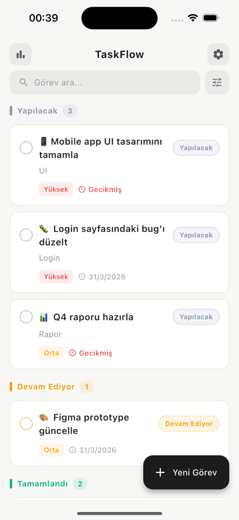 |

| Add Task | Dashboard | Settings |
|:---:|:---:|:---:|
| 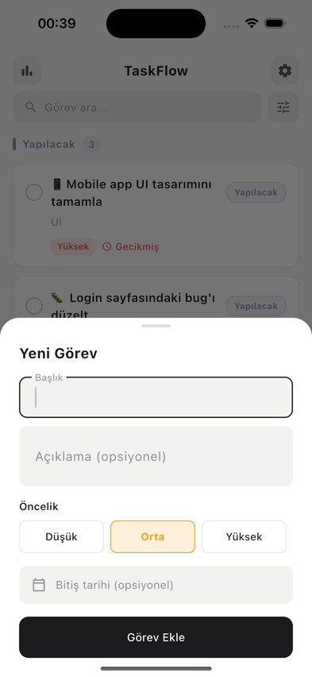 | 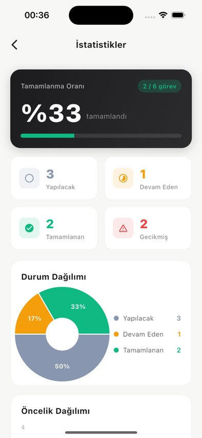 | 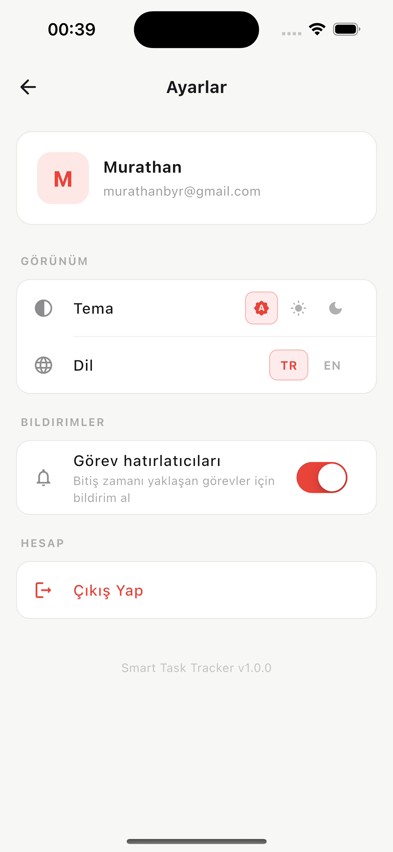 |

| Dark Mode | Filter | iOS Widget |
|:---:|:---:|:---:|
| 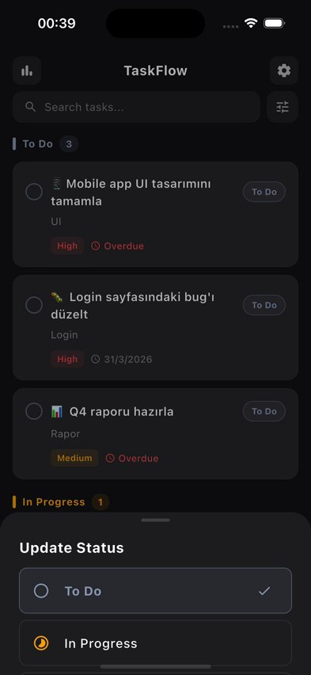 | 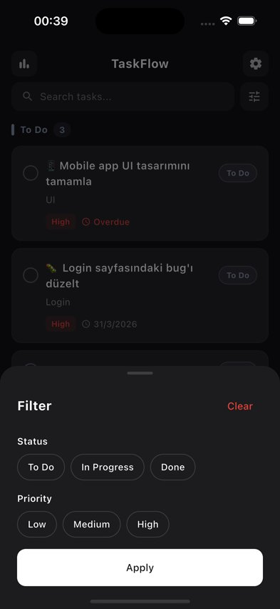 | 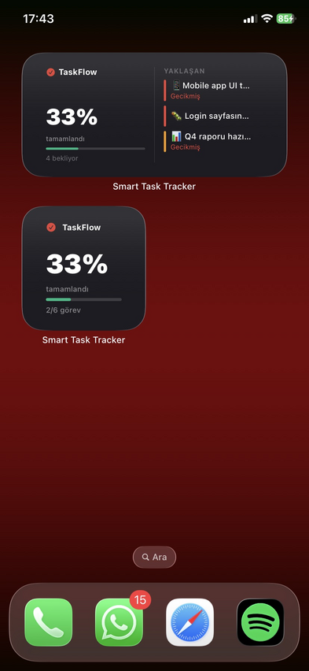 |

</div>

---

## 🔲 iOS Home Screen Widget

Smart Task Tracker includes a native **iOS Widget Extension** built with SwiftUI, allowing users to monitor their tasks directly from the home screen — no need to open the app.

**Small widget** shows:
- Overall completion percentage with a progress bar
- Total vs completed task count

**Medium widget** shows:
- Completion percentage + progress bar
- Up to 3 upcoming incomplete tasks sorted by priority
- Overdue indicators per task
- Color-coded priority bars (High / Medium / Low)

Data is synced from the Flutter app via **App Groups** (`UserDefaults`) and refreshes every 30 minutes automatically.

---

## ✨ Features

- 🔐 **Authentication** — Email/password & Google Sign-In via Firebase Auth
- ☁️ **Real-time Sync** — Live data sync across devices with Cloud Firestore
- 📴 **Offline Support** — Full offline functionality powered by Hive local database
- 🎯 **Smart Sorting** — Tasks auto-sorted by priority (High → Medium → Low), then by due date
- 🔔 **Push Notifications** — Scheduled reminders 1 hour before task deadlines
- 🔢 **App Icon Badge** — Live count of incomplete tasks on the app icon
- 📊 **Statistics Dashboard** — Completion rate, status pie chart, priority bar chart
- 🔍 **Search & Filter** — Real-time search with multi-filter (status + priority)
- ✏️ **Full CRUD** — Create, edit, delete tasks with swipe gestures
- ✅ **Completion Animation** — Elastic scale animation on task completion
- 🌍 **Localization** — Full Turkish & English support (TR/EN)
- 🌙 **Dark Mode** — System-aware dark/light theme
- 🚀 **Onboarding** — 3-page animated onboarding for first-time users
- 🔲 **iOS Widget** — Native SwiftUI widget (small & medium) with live task data

---

## 🛠 Tech Stack

| Category | Technology |
|----------|-----------|
| Framework | Flutter 3.41 |
| State Management | Riverpod 2.5 |
| Backend | Firebase (Auth + Firestore) |
| Local Database | Hive 2.2 |
| Authentication | Firebase Auth + Google Sign-In |
| Notifications | flutter_local_notifications |
| Connectivity | connectivity_plus |
| Charts | fl_chart |
| Animations | animate_do |
| Localization | Flutter l10n (ARB) |
| iOS Widget | SwiftUI + WidgetKit |
| Widget Data Bridge | home_widget + App Groups |
| Architecture | Feature-first, Service layer |

---

## 🏗 Architecture

```
lib/
├── core/
│   ├── providers/          # Global providers (settings, theme, locale)
│   └── services/           # Auth, Firestore, Hive, Notifications, Badge, Widget
├── features/
│   ├── auth/               # Login, Register, Google Sign-In
│   ├── tasks/              # Task list, CRUD, providers, models
│   ├── dashboard/          # Statistics, charts
│   ├── settings/           # Theme, language preferences
│   └── onboarding/         # First-launch onboarding flow
└── l10n/                   # TR + EN localization files

ios/
└── TaskWidgetExtension/    # Native SwiftUI Widget (WidgetKit)
    └── TaskWidget.swift
```

---

## 🚀 Getting Started

### Prerequisites

- Flutter 3.0+
- Firebase project with Firestore & Auth enabled
- Google Sign-In configured
- Xcode 14+ (for Widget Extension)

### Installation

```bash
# Clone the repository
git clone https://github.com/yourusername/smart_task_tracker.git
cd smart_task_tracker

# Install dependencies
flutter pub get

# Install iOS pods
cd ios && pod install && cd ..

# Run the app
flutter run
```

### Firebase Setup

1. Create a Firebase project at [console.firebase.google.com](https://console.firebase.google.com)
2. Enable **Authentication** (Email/Password + Google)
3. Enable **Cloud Firestore**
4. Download `GoogleService-Info.plist` (iOS) and place in `ios/Runner/`
5. Run `flutterfire configure`

---

## 📦 Key Packages

```yaml
flutter_riverpod: ^2.5.1      # State management
cloud_firestore: ^5.6.0       # Real-time database
firebase_auth: ^5.5.0         # Authentication
google_sign_in: ^6.2.1        # Google OAuth
hive_flutter: ^1.1.0          # Local offline cache
flutter_local_notifications   # Push notifications
connectivity_plus: ^6.1.4     # Network status
fl_chart: ^0.69.0             # Charts & graphs
flutter_slidable: ^3.1.1      # Swipe gestures
animate_do: ^3.3.4            # Animations
home_widget: ^0.7.0           # Flutter ↔ iOS Widget bridge
```

---

## 🌍 Localization

The app supports **Turkish** and **English** with full localization via Flutter's ARB system. Language can be changed from the Settings screen.

---

<div align="center">

Built with ❤️ using Flutter & Firebase

</div>